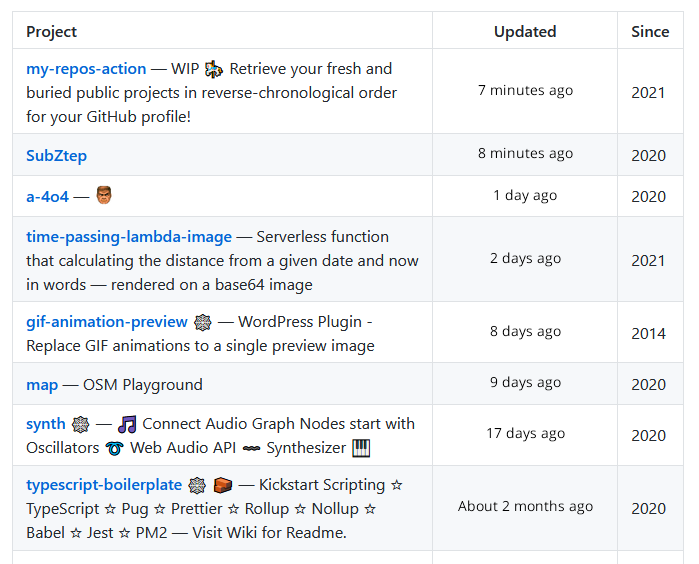

# My Repos Action

Retrieve your fresh and buried public projects in reverse-chronological order for your _GitHub_ profile!

This is just an experiment with Actions and API.

## Inputs

| Variable | Description |
| --- | --- |
| _**`ago`**_ | Url and Path for a [Timestamp to Image Lambda Function](https://github.com/SubZtep/time-passing-lambda-image) |
| _**`token`**_ | _GitHub_ Access Token |
| _**`actor`**_ | _GitHub_ Username |

## Outputs

| Variable | Description |
| --- | --- |
| _**`md`**_ | String of project list in Markdown table |

## Example workflow

```yml
name: My Repos

on: workflow_dispatch

jobs:
  my_repos:
    runs-on: ubuntu-latest
    name: Update Profile
    steps:
      - uses: SubZtep/my-repos-action@0.2.7
        id: my-repos
        with:
          ago: https://time-passing.netlify.app/.netlify/functions/ago?time=
          token: ${{ secrets.GITHUB_TOKEN }}
          actor: $GITHUB_ACTOR

      - uses: actions/checkout@v2
      - run: |
          cat ME.md > README.md
          printf "%s" "${{ steps.my-repos.outputs.md }}" >> README.md
          git config user.name github-actions
          git config user.email github-actions@github.com
          git commit -m "generated" -a
          git push
```

## What does it look like?

Here is a screenshot, or (probably) it's active on [my profile](https://github.com/SubZtep/SubZtep).



### :shipit:
